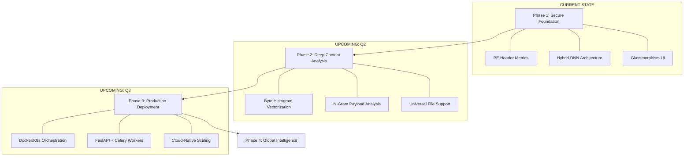

# AURA Scanner: Strategic Project Roadmap
*From Research Prototype to Global Malware Intelligence*

---

## 🗺️ Vision Overview
To evolve the **AURA Scanner** into a universal, high-throughput security gateway that combines structural "Context" with deep binary "Content" analysis, providing 100% visibility into unknown threats.

---

## 📊 Roadmap Visualization

---

## 🛠️ Phases of Growth

### Phase 1: Structural Context (Completed)
*Focused on the "Wrapper" of the file.*
- **Outcome**: Established a research-grade feature extractor for PE files.
- **Engine**: Hybrid Deep Neural Network + 8-Zero Heuristic failsafe.
- **Interface**: Premium, interactive local web environment.

### Phase 2: Deep Content Analysis (The "Inside-Out")
*Moving from "What the file says" to "What the file IS."*
- **Universal Processing**: Upgrading extractors to handle non-PE files (Linux ELFs, Office docs, PDF, Blobs) by treating the entire file as a byte-distribution.
- **Byte Histogramming**: Converting the entire binary file into a 256-dimension vector for the DNN, making it immune to header stripping.
- **N-Gram Tokenization**: Identifying repeating sequences of malicious machine code (e.g., shellcode signatures hidden in data).

### Phase 3: Enterprise Deployment & Scale
*Transitioning to a robust, "Always-On" website.*
- **System Architecture**:
    - **FastAPI Backend**: Optimized for high-concurrency file handling.
    - **Celery + Redis**: Asynchronous processing queue to handle files >100MB without blocking the UI.
    - **PostgreSQL**: Centralized database for "Scan History" and "Global Threat Hashes."
- **Cloud Infrastructure**: Deploying AURA as a containerized microservice on AWS/Azure using Kubernetes for auto-scaling during traffic spikes.

### Phase 4: AURA Intelligence Cloud
*The Global Feedback Loop.*
- **Dynamic Sandboxing**: Automatically routing "Borderline Confidence" files to a virtual sandbox for behavioral observation.
- **Automated Retraining**: A CI/CD for models where newly confirmed malware automatically triggers a retraining cycle to improve future accuracy.
- **Public API**: Exposing AURA as a "Detection-as-a-Service" for external developers and SOC teams.

---

## 🚀 The End-Goal
By the end of Phase 4, AURA will be a **Full-Stack Security Product**:
1. **Upload**: User drops ANY file (any extension, any size).
2. **Process**: Distributed workers analyze context + content + heuristics.
3. **Result**: A global verdict verified by both AI intuition and structural proof.
