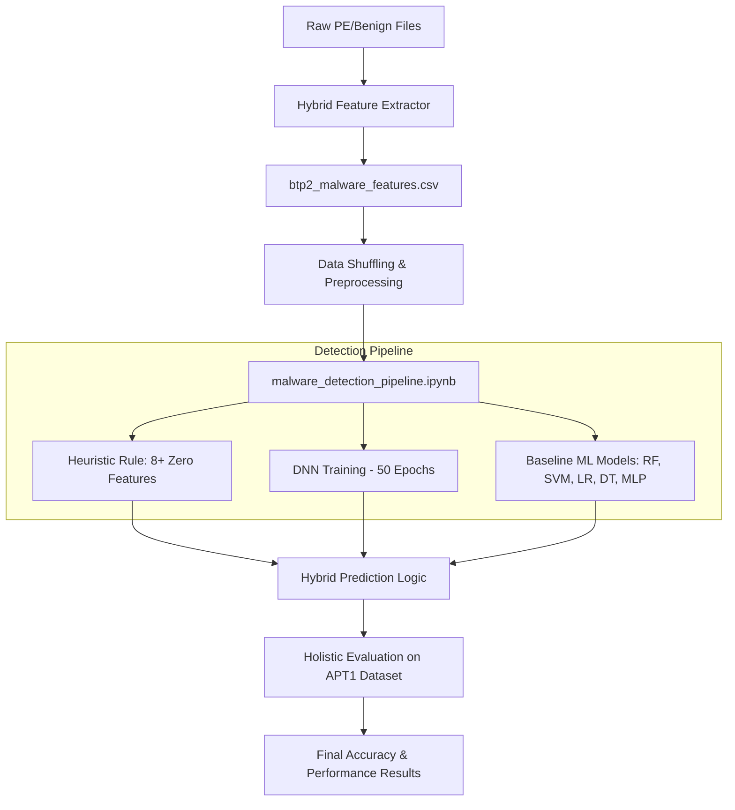

# Malware Detection Project

## Overview
This project focuses on detecting malware using a hybrid approach that combines Deep Learning (DNN), traditional Machine Learning models (Random Forest, SVM, etc.), and a zero-feature heuristic rule. The pipeline is designed to analyze Portable Executable (PE) files by extracting header metadata and byte-level features.

## Process Flow Diagram

## Key Components

### 1. Unified Pipeline (`malware_detection_pipeline.ipynb`)
The entire training and evaluation logic is consolidated into a single notebook. It performs:
- **Data Shuffling**: The training data is shuffled randomly to ensure the models learn generalized patterns. A shuffled version is saved as `btp2_malware_features_shuffled.csv`.
- **Heuristic Rule**: If a file has **8 or more missing (zeroed) features**, it is flagged as malware directly. This acts as a robust fail-safe before the ML models process the data.
- **DNN Model**: A deep neural network trained for 50 epochs on context-only features (PE headers).
- **Baseline Comparison**: Compares DNN performance against Random Forest, SVM, Logistic Regression, Decision Tree, and MLP.
- **External Validation**: All models are tested against the **APT1** dataset to verify real-world accuracy on advanced persistent threats.

### 2. Enhanced Feature Extractor (`hybrid_feature_extractor.py`)
This module has been upgraded to a research-grade static feature extractor. It extracts:
- **General Metadata**: File size, log-size, file age (days), hidden attribute flags, and executable extension checks.
- **Content Analysis**: Full-file Shannon entropy (with a High-Entropy flag for packed/encrypted detection).
- **Regex Detection**: Automated counting of URLs, IPv4 addresses, and suspicious keywords (e.g., `VirtualAlloc`, `CreateRemoteThread`, `powershell`).
- **PE-Specific Metrics**: Modular parsing of PE headers to extract section counts, DLL imports, and a **Suspicious API Ratio**.
- **Derived Bio-metrics**: Advanced features like *suspicious density* (keywords/size) and *import density* (functions/sections).

## Workflow

1. **Step 1: Feature Extraction (Optional)**
   Run `hybrid_feature_extractor.py` to generate the raw dataset from binaries.
   
2. **Step 2: Unified Detection & Training**
   Open and run `malware_detection_pipeline.ipynb`. This will:
   - Shuffle `btp2_malware_features.csv`.
   - Train the DNN and baseline models.
   - Apply the **8+ zero-feature heuristic**.
   - Test accuracy on `apt1_features.csv`.
   
3. **Step 3: Review Results**
   Check the generated visualizations and performance tables at the end of the notebook.

## Project Structure
- `malware_detection_pipeline.ipynb`: The primary project engine.
- `btp2_malware_features.csv`: The core training dataset.
- `apt1_features.csv`: The external test dataset for threat detection.
- `best_context_dnn.h5`: Saved weights for the DNN model.
- `scaler_context.pkl`: Serialized feature scaler.
